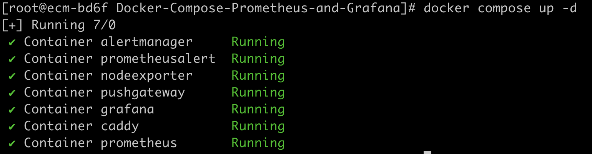
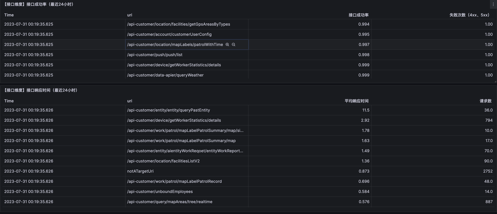
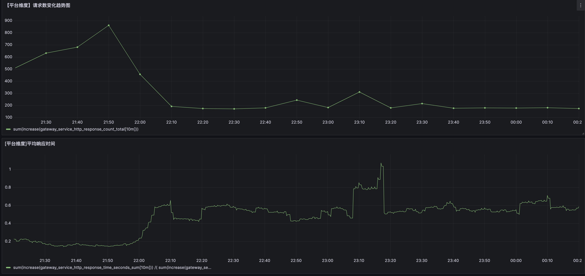
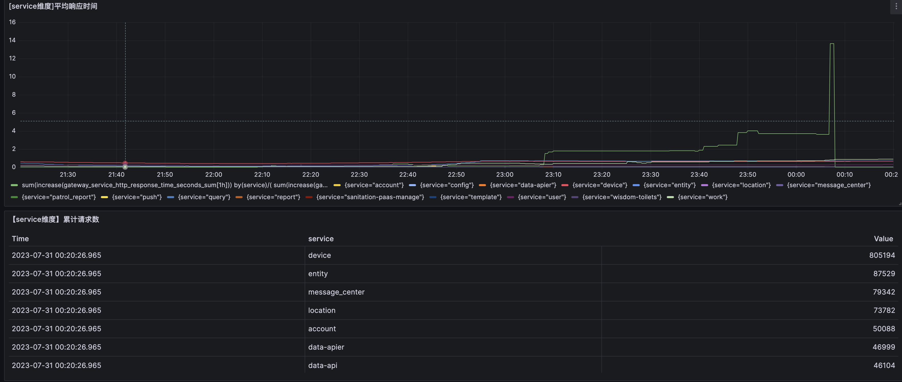
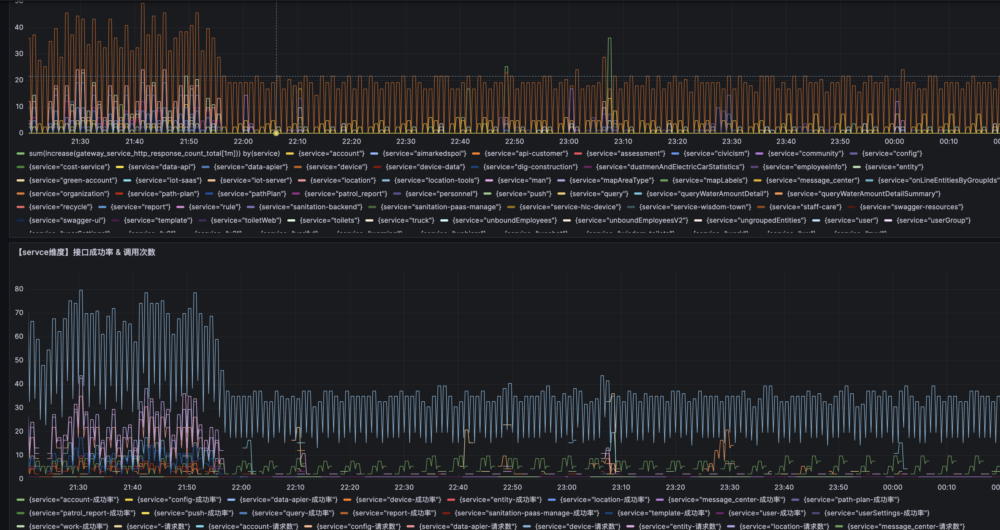

微服务架构下，nginx网关日志一站式收集、监控报警、数据分析。可以实现的功能：
- service成功率低于阈值进行报警
- 接口成功率低于阈值进行报警
- 接口同比上周变慢，进行预警
- 可视化展示所有接口耗时、成功率，并进行排序
- 可视化展示service的成功率、请求数，并进行排序
- ...

[toc]

# 项目介绍
在微服务架构下，网关是整个平台流量的入口，在用户和网关之间，一般会用nginx做反向代理。如果想监控api的成功率、延迟情况，对nginx的日志进行分析是一种不错的思路。

nginx网关的access log中，url部分格式一般如下：
```
api/user/path1/path2?a=1&b=2
api/order/path1/path2?a=1&b=2
api/device/path1/path2/123?a=1&b=2
api/device/path1/path2/456?a=1&b=2
api/device/path1/path2/789?a=1&b=2
```
它有两个特点：
1. /api后面跟的是微服务的名字。如user、order都是服务的名字
2. url中的123、456、789代表的可能是商品的id，如果想对接口成功率进行监控，就需把他们归一化成一个url

该项目的目标：

对上述的该类nginx accesslog进行分析，生成uri和service两个维度的prometheus指标，然后进行这两个维度的异常告警、数据分析。

# 部署方式
## 第一步：生成uri和service维度prometheus指标
该步骤的输入是nginx access log，输出是prometheus metrics。

通过我的另外一个[项目](https://github.com/MuChenMuXuan/nginx-log-exporter)，可完成该步骤。

生成的metrics示例如下：
```
gateway_service_http_response_count_total{method="GET",service="data-api",status="200"} 3357
gateway_service_http_response_count_total{method="GET",service="data-api",status="4xx"} 12
gateway_service_http_response_count_total{method="GET",service="data-api",status="5xx"} 173
gateway_service_http_response_count_total{method="GET",service="data-apier",status="200"} 3592
gateway_service_http_response_count_total{method="GET",service="data-apier",status="4xx"} 119
gateway_service_http_response_count_total{method="GET",service="data-apier",status="5xx"} 728
gateway_service_http_response_count_total{method="GET",service="device",status="200"} 40449
gateway_service_http_response_count_total{method="GET",service="device",status="4xx"} 10
gateway_service_http_response_count_total{method="GET",service="device",status="5xx"} 314

gateway_uri_http_response_count_total{method="GET",status="200",uri="/api-customer/device/:id/trackDetail"} 742
gateway_uri_http_response_count_total{method="GET",status="200",uri="/api-customer/device/:id/workAttendanceDetail"} 739
gateway_uri_http_response_count_total{method="GET",status="200",uri="/api-customer/device/entity/:id/historyData"} 1
gateway_uri_http_response_count_total{method="GET",status="200",uri="/api-customer/device/entity/:id/locsByTime"} 2
gateway_uri_http_response_count_total{method="GET",status="200",uri="/api-customer/device/entity/:id/search"} 712
```
ok，这里就有了接口和service两个维度的metrics数据。

## 第二步：利用docker compose快速安装prometheus、grafana、相关报警组件
进入目录Docker-Compose-Prometheus-and-Grafana，执行
```
docker compose up -d
```
就完成了相关监控组件的安装:


相关配置文件：

1、[prometheus.yml](./Docker-Compose-Prometheus-and-Grafana/prometheus/prometheus.yml)
```
 - job_name: 'nginx-gateway'
    scrape_interval: 10s
    honor_labels: true
    static_configs:
      - targets: ['host.docker.internal:9999']
    metrics_path: /metrics
```

2、[prometheus报警规则](./Docker-Compose-Prometheus-and-Grafana/prometheus/alert.rules)

```
groups:
- name: host
  rules:
  - alert: gateway_service_success_rate
    expr: ((sum(increase(gateway_service_http_response_count_total{status='5xx'}[2m])) by (service))/(sum(increase(gateway_service_http_response_count_total{}[2m])) by (service) > 10)) > 0.2
    for: 5s
    labels:
      severity: warning
    annotations:
      summary: "service成功率低于80%"
      description: "服务 {{ $labels.service }} 最近2分钟接口失败率{{$value}}"

  - alert: gateway_interface_success_rate
    expr: ((sum(increase(gateway_uri_http_response_count_total{status=~'5xx|4xx'}[10m])) by (uri))/(sum(increase(gateway_uri_http_response_count_total{}[10m])) by (uri) > 5)) > 0.5
    for: 5s
    labels:
      severity: warning
    annotations:
      summary: "接口成功率低于50%"
      description: "接口 {{ $labels.uri }} 最近10分钟接口失败率{{$value}}"

  - alert: gateway_interface_slow
    expr: ((sum(increase(gateway_uri_http_response_time_seconds_sum[24h] )) by (uri) /(sum(increase(gateway_uri_http_response_time_seconds_count[24h]) ) by (uri)  > 10)) > 2/(sum(increase(gateway_uri_http_response_time_seconds_sum[24h]  offset 1d)) by (uri) /(sum(increase(gateway_uri_http_response_time_seconds_count[24h] offset 1d) ) by (uri)  > 10)) > 0)>2
    for: 5s
    labels:
      severity: warning
    annotations:
      summary: "接口同比上周变慢"
      description: "接口 {{ $labels.uri }} 最近24小时平均响应时间是上周的{{$value}}倍，同时当前平均响应时间大于2s，请关注!"
```

3、[报警通知方式](./Docker-Compose-Prometheus-and-Grafana/alertmanager/config.yml)

到这里，就通过prometheus，实现了uri和service维度的异常报警。

## 第三步：通过共享的grafana dashboard json，快速实现可视化图表
[配置文件](./granafa/dashboard.json)

效果：









# 感谢
- https://github.com/Einsteinish/Docker-Compose-Prometheus-and-Grafana
- https://github.com/songjiayang/nginx-log-exporter

